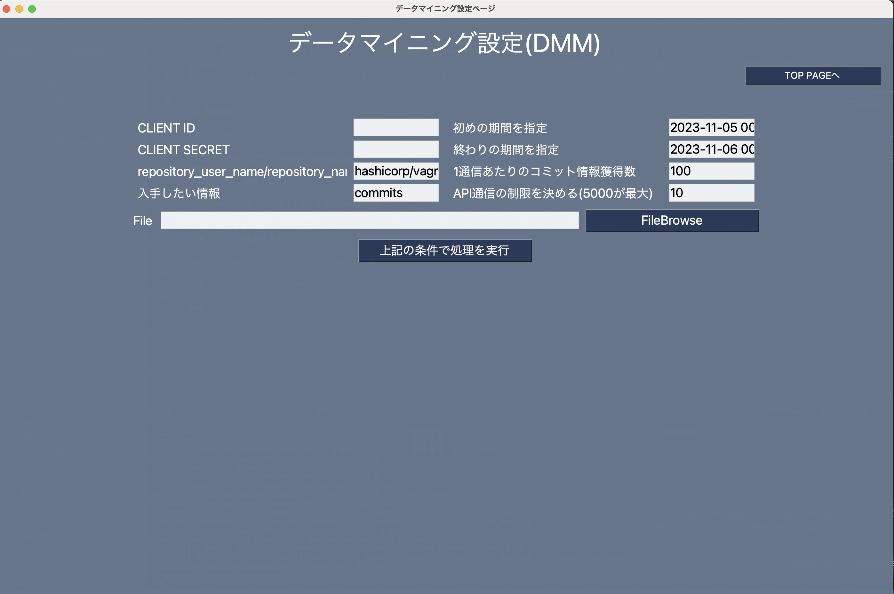
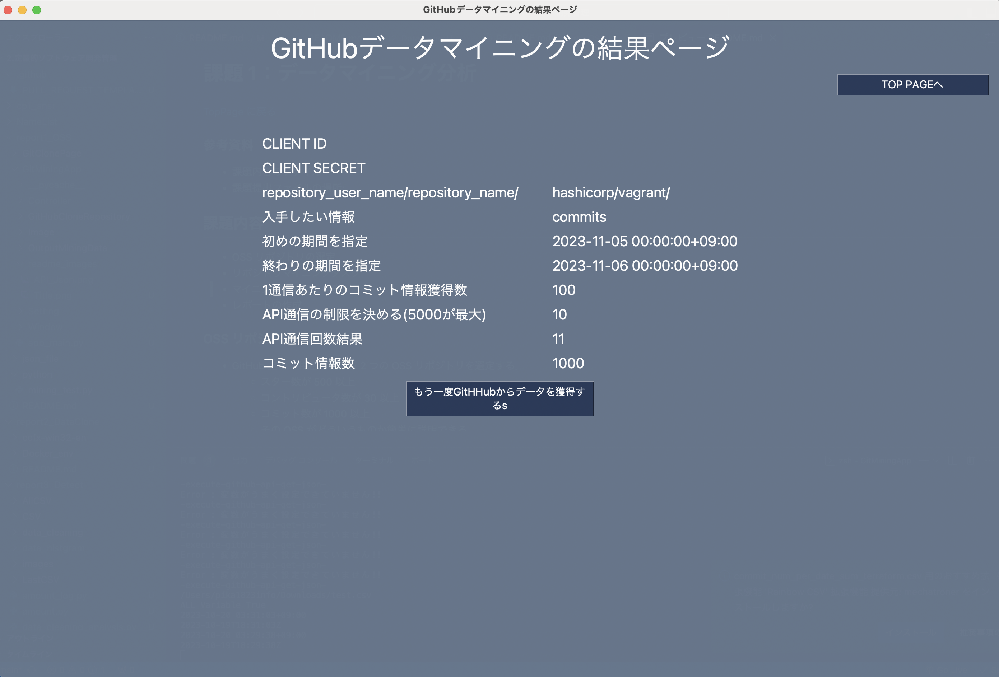
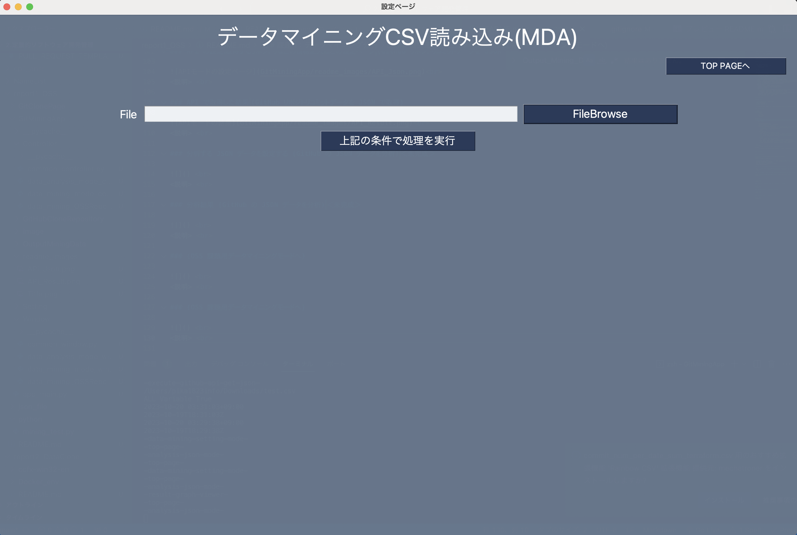
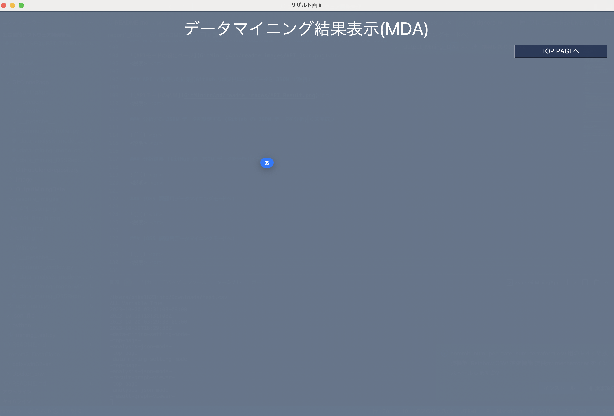
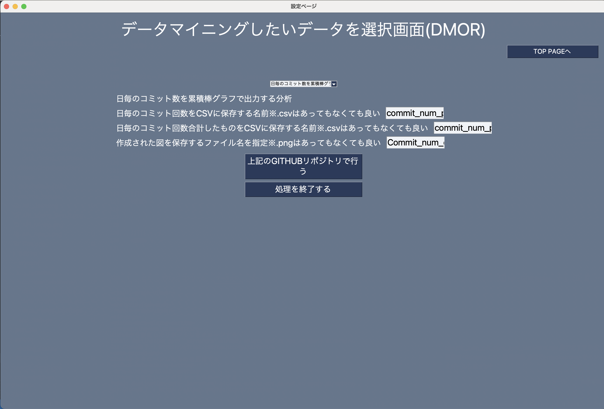

# 課題 1：データマイニング分析

[TopPage に戻る](../README.md)

### 参考資料

- 課題内容のファイル：「/講義資料/課題 1：発表資料」
- 課題提出ファイルの場所:「/課題提出/第 1 回：OSS/定量的ソフトウェア開発管理\_第 1 回課題 OSS_50M23229.pdf」

## 課題内容

- OSS リポジトリの選定
- リポジトリマイニングタスク
- マイニングの結果の考察
- レポートの作成

### OSS リポジトリの選定

- GitHub 上で，共通点のある 2 つの OSS リポジトリを選定する．
  - スター数が 500 以上
  - コントリビュータ数が 30 以上
  - コミット数が 1000 以上
  - その OSS がどういうものか簡単に説明できる
  - その一組が他人と被らなさそうである
  - 共通点はソフトウェアの内容に関連するものであること
- 選択した 2 つの OSS リポジトリに対して，コミット履歴データをマイニングし以下のグラフを作成する
  - グラフ 1：合計コミット数の時間変化グラフ(1 日のコミット数の積み上げ折れ線グラフ)
  - グラフ 2：コミット数上位 10 名のコミット数を表す棒グラフ
  - グラフ 3：コミットメッセージの語数のヒストグラム
- コミット履歴データの指定
  - 全コミット，または直近 10000 件のコミット
- マイニング方法やグラフ作成に必要な操作は自由
- マイニング結果の考察
  - グラフ 1〜3 のそれぞれについて，リポジトリ A,B を対象とした場合
    - リポジトリ A のグラフの形状がそのようになった要因
    - リポジトリ B のグラフの形状がそのようになった要因
    - リポジトリ A と B のグラフの形状が異なった要因，あるいは類似した要因
  - 理想として OSS リポジトリ上の情報からその根拠を併記
  - 難しいようであれば，仮説でもよい．

## コード内容

### 実行手順

- report1_OSS のディレクトリに入る
- cd GitMiningApp
- python3 app_main.py

※ pythonSimpleGUI という GUI ライブラリをインストールする必要がある．

### フォルダ構成

```Shell
GitClonePage
		→ figure
		→ git_data
		→ terraform
		→ vagrant

GitMiningApp
		→ __pycache__：
		→Controller：処理を記述するファイル群
			→ common_controller.py：
			→ data_analysis_mode_controller.py：
			→ data_mining_mode_controller.py：
			→ data_mining_OSSRepository_controller.py：
		→ GitHubCloneRepository：ここにクローンするリポジトリが保存され，終了後削除
			→terraform：クローンしたリポジトリ
		→ Image：GUIアプリで使用する画像
		→ OutputMiningData：マイニングしたデータを表などで見れるようにしたもの
			→ csv：分析データの中で欲しいデータを取り出したCSVデータの出力
			→ graph：分析データから作成したグラフ
			→ text：
		→ Setting：モードごとの変数コード群
			→ common_settings.py：共通部分の変数
			→ data_analysis_mode_settings.py：データ分析に使用する変数
			→ data_mining_mode_settings.py：APIマイニングモードの変数
			→ data_mining_OSSRepository_Setting.py：リポジトリマイニングするモードで使用する変数
		→ Window：画面表示用のコード群
			→ common_window.py：共通画面を表示
			→ data_analysis_mode_window.py：データ分析モードの画面を表示
			→ data_mining_mode_window.py：APIマイニングモードの画面を表示
			→ data_mining_OSSRepository_window.py：リポジトリマイニングするモードの画面を表示
		→ app_main.py：このプログラムを起動する時に実行するファイル．

json_file
		→ テストコードを実行した時のJSONを保存する場所
python
		→ テストで実際にGitHubのリポジトリデータをJSON形式で取得するコード
```

## 画面遷移

### Title ページ

<br>
<説明> <br>
下記のページに遷移できます．

- GitHub リポジトリコミットデータを JSON で取得：GitHubAPI を使用してデータマイニングするための JSON を取得するモード
- GitHub の JSON データを分析：
- OSS 課題用データマイニングモードへ：
- 終了：アプリを終了する

### API の設定，取得するリポジトリなどの情報記入などの設定ページ　(GitHub リポジトリコミットデータを JSON で取得)

<br>
<説明> <br>

- CLIENT_ID：GitHub の API 通信登録していて，制限を緩和できる
- CLIENT_SECRET：GitHub の API 通信登録していて，制限を緩和できる
- repository_user_name/repository_name：使用するリポジトリ情報を記入
- 入手したい情報：どの GitHub 情報を獲得したいかを決める．デフォルトは「commits」
- 初めの期間を指定：どの期間の情報を獲得するか
- 終わりの期間を指定：どの期間の情報を獲得するか
- 1 通信あたりのコミット情報獲得数：1 回の通信で獲得する情報の数を指定
- API 通信の制限を決める（5000 が最大）：緩和して 5000 が限界なので，それ以上してもエラーとなる．
- File：情報を保存したいファイルを指定．CSV に保存する．

### API で取得した結果　(GitHub リポジトリコミットデータを JSON で取得)

<br>
<説明> <br>
どのような情報を獲得できたかの概要が表示される．

### 分析する JSON データを設定する (GitHub の JSON データを分析)　＜未完成＞

 <br>
<説明> <br>
CSV ファイルの読み込み口があるので，そこで，先ほど API で獲得した CSV を読み込んで分析を行うことができる．
しかし，未完成である．こちらを今回使用して講義課題を行っていないため最後まで作成していない．

### 分析結果 (GitHub の JSON データを分析)　＜未完成＞

 <br>
<説明> <br>
未完成．グラフを出力してみれるようにしたい．

### 分析リポジトリを設定(OSS 課題用データマイニングモードへ)

 <br>
<説明> <br>

- GitHub 作成者：作成者の名前
- GitHub リポジトリネーム：リポジトリの名前

### 指定したもので分析を行なってグラフを出力(OSS 課題用データマイニングモードへ)

 <br>
<説明> <br>

- ドロップダウンで出力したいグラフを決める：「日毎のコミット数を累積棒グラフで出力する分析」「コミット数 TOP10 の棒グラフを分析」「コミットメッセージの文字数の分布を分析」から選択
- 保存する CSV の名前を決める
- 保存するグラフの名前を決める
